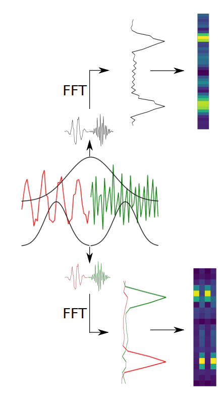

# Classifier with Differentiable STFT front-end

This directory contains code to train a simple classifier with our differentiable STFT front-end to obtain the optimal STFT window length (along with the classifier weights) for minimizing the classification loss. The following figure aims to explain how classification can be affected by choosing an incorrect window size:

The code uses JAX1 and Haiku2. For all the other necessary libraries/prerequisites, please use conda/anaconda to create an environment (from the environment.yml file in this repository) with the command   
~~~
conda env create -f environment.yml
~~~

---
### References
[1] https://github.com/google/jax

[2] https://github.com/deepmind/dm-haiku

